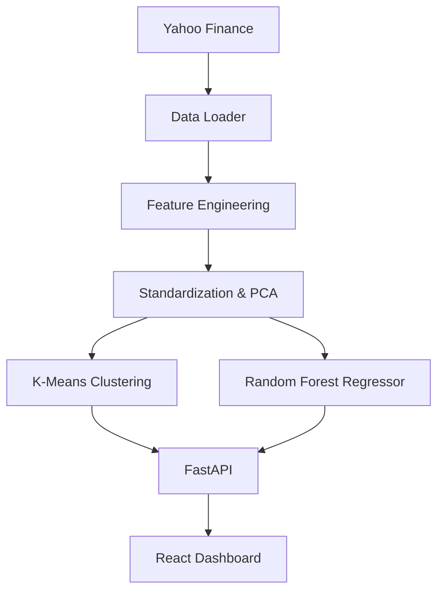

# SmartStock Insight: Quantum Intelligence Terminal

A high-performance stock analytics and prediction platform that combines machine learning, dimensionality reduction (PCA), and unsupervised clustering (K-Means) to provide deep market intelligence.

## 🚀 Key Features

- **Quantum Price Action**: Interactive time-series charts for multi-stock analysis.
- **Dimensionality Reduction (PCA)**: Compresses technical indicators into primary components for cleaner signal processing.
- **Market Regime Clustering**: Uses K-Means clustering to identify different market states and patterns.
- **Return Prediction**: Random Forest Regressor trained on PCA-reduced features to predict future stock returns.
- **Dynamic Intelligence Bar**: Real-time KPI tracking including volatility, volume changes, and predicted trends.
- **Glassmorphism UI**: A premium, state-of-the-art analytical dashboard built with React and Tailwind CSS.

---

## 🛠️ Tech Stack

### Frontend (Modern Analytical UI)
- **Framework**: Vite + React + TypeScript
- **Styling**: Tailwind CSS (Dark Mode, Glassmorphism)
- **UI Components**: Shadcn/UI + Radix UI
- **Visualization**: Recharts (Quantum Charts)
- **State Management**: TanStack Query (React Query)
- **Icons**: Lucide React

### Backend (Intelligent Logic)
- **Framework**: FastAPI (High-performance Python API)
- **Data Engine**: Pandas & NumPy
- **ML Libraries**: Scikit-learn (PCA, K-Means, Random Forest)
- **Stock Data**: yfinance (Yahoo Finance API)
- **Analysis**: ta (Technical Analysis Library)

---

## 🏗️ Project Architecture



1. **Data Pipeline**: Fetches historical data and calculates over 20 technical indicators.
2. **PCA Service**: Reduces feature dimensionality while retaining 95%+ of variance to avoid overfitting.
3. **Clustering Service**: Labels data points into clusters to identify similar market conditions.
4. **Prediction Service**: Trains aregressor to map primary components to future returns.

---

## 📦 Installation & Setup

### 1. Prerequisites
- Python 3.10+
- Node.js 18+
- Bun or npm

### 2. Backend Setup
```bash
# Navigate to the project folder
cd smart-stock-insight-main

# Create and activate a virtual environment
python -m venv .venv
source .venv/bin/activate  # On Windows: .venv\Scripts\activate

# Install dependencies
pip install -r requirements.txt

# Train the model (Initial run)
python train.py

# Start the FastAPI server
uvicorn backend.main:app --reload
```

### 3. Frontend Setup
```bash
# From the smart-stock-insight-main folder
npm install
# or
bun install

# Start the development server
npm run dev
# or
bun dev
```

---

## 📊 Documentation & Methodology

### Feature Engineering
The system extracts:
- **Momentum**: RSI, ROC
- **Volatility**: Bollinger Bands, ATR
- **Trend**: Moving Averages (EMA, SMA)
- **Volume**: On-Balance Volume (OBV)

### Training Pipeline
- **PCA**: Reduces 20+ features down to 5-10 "Principal Components".
- **Clustering**: Groups data into a fixed number of clusters (configured in `config.py`).
- **Prediction**: Regresses future return (%) using a Random Forest model with 500 estimators.

---

## 📂 File Structure

```text
.
├── backend/                # FastAPI application
│   ├── routes/             # API Endpoints
│   ├── services/           # ML and Data Logic
│   └── models/             # Pickled ML models
├── src/                    # React frontend source
│   ├── components/         # Shadcn and custom components
│   └── pages/              # Dashboard and views
├── train.py                # Pipeline for model training
├── requirements.txt        # Python dependencies
└── package.json            # Node.js dependencies
```

---

## 📄 License
MIT

Developed by [VanshCodeScript](https://github.com/VanshCodeScript)
